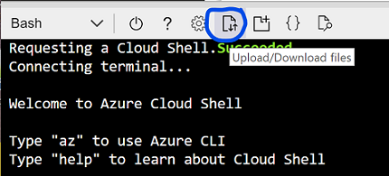
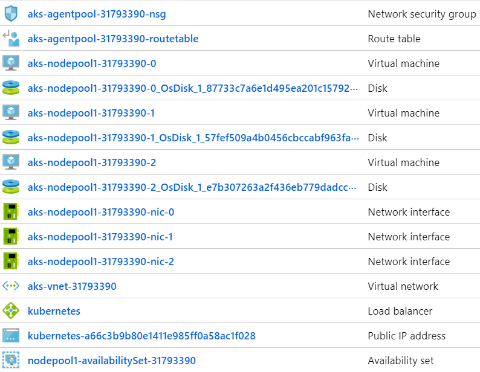
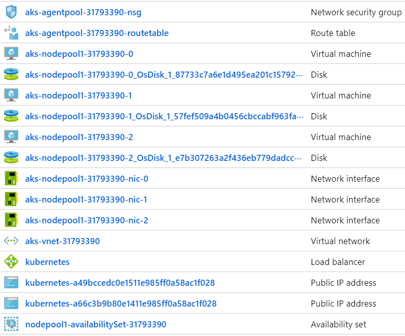
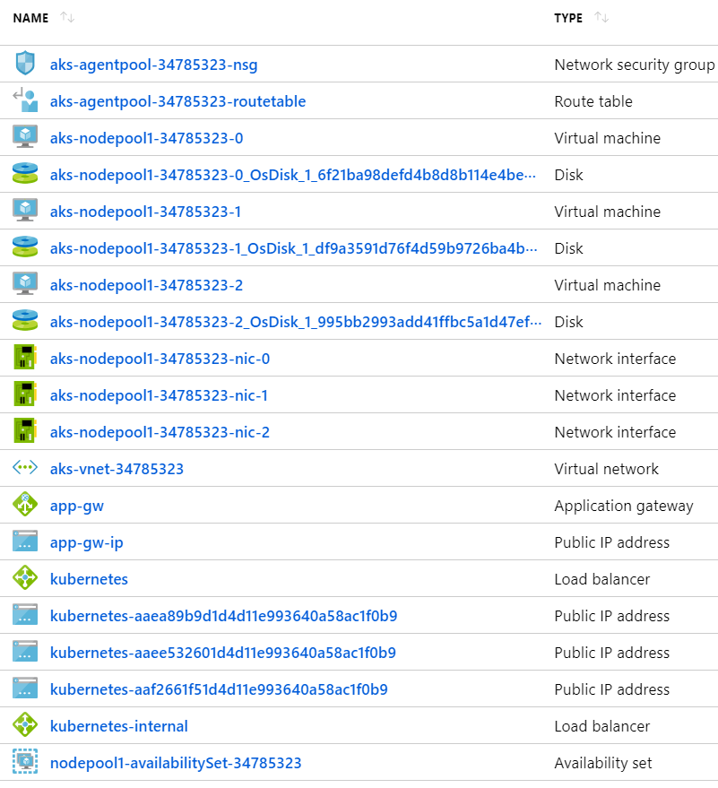

# AKS Walk Through
#### 100 level

## Scenario
In this walk through of AKS basics, we're going to create an AKS cluster and deploy services to the cluster. Much of the code is based on <https://docs.microsoft.com/en-us/azure/aks/kubernetes-walkthrough> but additional details and scenarios are covered. Note that this is a high level overview, so a lot of topics are not covered and those that are covered are high level. This is designed to be the first few steps on the AKS journey. 

All deployments are done using the "declarative" approach - read more here: <https://kubernetes.io/docs/concepts/overview/object-management-kubectl/declarative-config/>

After creating the cluster,  we will deploy a simple web app. This will create an Azure Public IP address and and a public Azure Load Balancer. We will also use kubectl to execute commands on a running container, including an interactive bash shell.

Next, we will deploy a backend service based on the standard Redis Docker container, demonstrating how to connect to containers in the cluster via port forwarding. 

Next we will deploy a web front end which uses the Redis backend as a server. This will automatically create an Azure Public IP address and reconfigure the Azure Load Balancer.

Next we will create a web app that uses a private load balancer and setup Azure Application Gateway to provide HTTPS termination and support.

Lastly, we'll delete everything.

The full walk through takes about 3 hours.

### Additional Reading

[A collection of links](links.md)

## Prerequisites

* Azure subscription with permissions for:
  * Creating Resource Groups
  * Creating VMs
  * Creating AKS / ACR
  * Creating Service Principals
* Access to Azure Portal and Azure Cloud Shell (bash)
  * To setup Cloud Shell, you need permissions to create a storage account if one doesn't exist

### Approach

There are many ways to run the Azure, Docker and Kubernetes CLIs. For this lab, we are going to use Azure Shell to create an Ubuntu "build server". We will then SSH into the build server and run the lab from the build server. This avoids the issues you run into when trying install everything locally and ensures that everyone is starting from a known status (DevOps).

## Let's get started

Open the Azure Portal in a new window <https://portal.azure.com>

This walk through uses Azure Cloud Shell (click on the >_ icon in the top header)

If this is your first time using Azure Cloud Shell, installation instructions are [here](cloudshell.md)

### Clone this repo

```

git clone https://github.com/4-co/aks-quickstart aks
cd aks

```

### If you have more than one subscriptions - select the one you want to use

```

# show default subscription
az account show

# list all subscriptions
az account list -o table

# change your default subscription if desired
az account set -s <your-subscription>

az account show

```

### set ACR name

```

# ACR_NAME has to be a unique DNS address
# DNS rules apply - all lower case, start end with character; character, numeric and - only
# use ping to check uniqueness
# if you don't get "Name or service not known", change ACR_NAME until you do

ACR_NAME=your-desired-name
ping ${ACR_NAME}.azurecr.io

# update ~/setenv
sed s/{{acr_name}}/${ACR_NAME}/ setenv > ~/setenv
source ~/setenv

# check the environment variables
env | grep AKS
env | grep ACR

```

### Note

If multiple people are using the same subscription, you will need to edit setenv and change AKSRG and ACSRG to be unique

```
nano ~/setenv

# change AKSRG and ACSRG to be unique
# do not make any other changes
# press <ctl> x to exit
# press s to save

```

### Set the environment variables
```

# set env
source ~/setenv

# Save environment variables for future shells
echo " " >> ~/.bashrc
echo "git -C ~/aks pull" >> ~/.bashrc
echo ". ~/setenv" >> ~/.bashrc

```

### Create Resource Groups

```

az group create --name $AKSRG --location $AKSLOC
az group create -n $ACRRG --location $AKSLOC

```
### Generate ssh keys and upload to Azure Cloud Shell

Open a command prompt on your local machine to generate the id_rsa and id_rsa.pub keys.

```
cd ~

# Create a .ssh folder (if it doesnt already exist)
mkdir .ssh
cd .ssh

# Generate the keys
ssh-keygen -t rsa -f ~/.ssh/id_rsa -N ''

```
Go back to your browser with Azure Cloud Shell.

Click on the "Upload/Download files" button and select the newly generated id_rsa and id_rsa.pub.
<br>(You will have to do this once per file)



```
# In Azure Cloud Shell, you should see your uploaded keys in the home dir.
cd ~
ls

# Move the keys to the .ssh folder
mv id_rsa id_rsa.pub .ssh/
```

### Create a Docker build server

```

# this takes a while
./setup

# press enter every once in a while to keep Azure Cloud Shell from timing out

```

### Docker overview slides

A quick Docker introduction while our Build Server deploys

### Copy your ssh keys

You will need to copy the id_rsa and id_rsa.pub files from ~/.ssh to your local machine.

```

# In a Windows Command Prompt
md %USERPROFILE%/.ssh
cd %USERPROFILE%/.ssh

# In Azure Cloud Shell
# Copy the key
cat ~/.ssh/id_rsa

# In Windows command prompt
notepad id_rsa.
# Paste the key
# Save and exit

# Repeat for id_rsa.pub

```

### ssh into the build server

Get the address of the build server (it should be displayed in the Azure Cloud Shell window)

```

export DHOST="aks@`az network public-ip show -g $ACRRG -n dockerPublicIP --query [ipAddress] -o tsv`" && echo $DHOST

```

## Connect to the build server

Open a command prompt or terminal window and enter the following command substituting the address of your build server. The rest of the walkthrough will be done from this terminal window.

Note that if SSH is blocked by your firewall, you can continue to use Azure Cloud Shell. We use the native SSH client because cutting and pasting text is easier.

ssh aks@xxx.xxx.xxx.xxx

Your prompt should look like this:

aks@docker:~$

### Make sure post install script has completed

```

# should return ready
# if not ready, rerun the command until it is
cat status

# make sure the repo is up to date
cd aks
git pull

```

### Setup AKS

You can run this from Cloud Shell or from the build server. If you run from the build server, you must follow the same az login steps from above and modify and source setenv *exactly* the same. Some steps in the walkthrough require you to use the build server but most of the walkthrough can be completed from Cloud Shell.

```

# Create service principal
# if the SP exists, this will fail - change $AKS_SP
export AKS_PWD=$(az ad sp create-for-rbac --skip-assignment -n http://$AKS_SP --query password --output tsv) && echo $AKS_PWD

# get the App ID 
export AKS_APP_ID=$(az ad sp show --id http://$AKS_SP --query appId --output tsv) && echo $AKS_APP_ID

# Save for later
echo $AKS_PWD > ~/.ssh/aks_pwd
echo $AKS_APP_ID > ~/.ssh/aks_app_id

# Get the latest AKS version number
az aks get-versions -l centralus -o table

# Replace 1.13.5 if desired

# create AKS cluster
az aks create -g $AKSRG \
-n $AKSNAME \
-c 3 \
-s $AKSSIZE \
--kubernetes-version 1.13.5 \
--no-ssh-key \
--service-principal $AKS_APP_ID \
--client-secret $AKS_PWD

# this will take a while


```

### Docker walk through

Here's a quick [Docker walk through](docker.md)

### Get the k8s credentials and save in ~/.kube/config

```

cd ~/aks

az aks get-credentials -g $AKSRG -n $AKSNAME

cat ~/.kube/config

```

### We're going to cheat a little ...

[Open cheat.md](cheat.md) - we're going to start the setup of the services and application gateway so we don't have to wait as long.

### AKS / Kubernetes Introduction

Some quick slides on Kubernetes and AKS

### AKS Setup

If you check the Azure portal, you will see that AKS setup created two resource groups - aks and MC_aks_aks_centralus. (there is also an ACR resource Group where the build server is running and a NetworkWatcherRG) The aks resource group contains the AKS service (Controller). The MC_aks_aks_centralus resource group contains the k8s nodes. Here is a screen shot of what is created in the MC_aks_aks_centralus resource group. You will notice that there are 3 Nodes (VMs).


### We're going to finish cheating ...

[Open cheat.md](cheat.md) - we're going to finish the setup of the services and application gateway so we don't have to wait as long.

### Some basic commands

kubectl is the Kubernetes CLI. 

setenv (which runs in .profile) creates a "k" alias to make typing easier, so you can type k instead of kubectl

Some of the commands are easy to type. Others are easier to copy and paste.

```

# see what's running
# notice all the services we created
kubectl get all

# Run an app (technically, create a deployment)
kubectl create deployment goweb --image=fourco/go-web-aks

# see what was created
kubectl get all

# That's a LOT
kubectl get deploy,pods

# get the name of the goweb pod
GW=`kubectl get pod | grep goweb` && set -- $GW && GW=$1 && echo $GW

# Check the logs
kubectl logs $GW

# run shell commands
# these commands execute "inside" your running container

# check the local website
kubectl exec $GW -- curl localhost:8080
kubectl exec $GW -- curl localhost:8080/healthcheck

# check the logs again
kubectl logs $GW

```

### Port forwarding

You can use port forwarding to expose the port to the local host. This will work on a deployment, service, pod, etc.

```

# start port forwarding in the background
# you may have to press enter twice to get your prompt back
kubectl port-forward deploy/goweb 8080:8080 &

# this will also work by using the pod - but not at the same time!
kubectl port-forward $GW 8080:8080 &

# run curl
curl localhost:8080
curl localhost:8080/healthcheck

# bring to foreground and cancel
fg
# press <ctl> c to end port forwarding

# check the logs again
kubectl logs $GW

```

### Delete the deployments

```

kubectl delete svc,deploy goweb
kubectl get deploy,pods

```

### Declarative Deployments

The preferred way to use k8s is to use the declarative approach which uses yaml files. Since yaml files are text files, they are easy to manage with source code control which makes building a cluster from scratch repeatable.

Read more here: <https://kubernetes.io/docs/concepts/overview/object-management-kubectl/declarative-config/>

k8s has the ability to generate starter yaml files for you.

```

# generate a simple yaml file
kubectl create deployment goweb --image=fourco/go-web-aks --dry-run -o yaml

```

Output should look like this

```
apiVersion: apps/v1
kind: Deployment
metadata:
  labels:
    app: goweb
  name: goweb
spec:
  replicas: 1
  selector:
    matchLabels:
      app: goweb
  template:
    metadata:
      labels:
        app: goweb
    spec:
      containers:
      - image: fourco/go-web-aks
        name: goweb

```

Generate sample yaml for a LoadBalancer

```

kubectl create svc loadbalancer goweb --tcp=80:8080 --dry-run -o yaml

```

Output should look like this

```
apiVersion: v1
kind: Service
metadata:
  labels:
    app: goweb
  name: goweb
spec:
  ports:
  - name: web
    port: 80
    protocol: TCP
    targetPort: 8080
  selector:
    app: goweb
  type: LoadBalancer

```


### Deploy a jump box

```

cd ~/aks

kubectl apply -f jumpbox/jbox.yaml

kubectl get pod

```

### Deploy a simple web app

This is a simple web app without any dependencies. Because replicas is set to 3, there will be 3 instances running. AKS will create an Azure Load Balancer and a Public IP Address. The Azure Load Balancer sends traffic to each pod. Note that Azure Load Balancer keeps the TCP connection alive, so you will connect to the same node for up to 5 minutes if you hit refresh.

The source code for the web app is available here: <https://github.com/4-co/go-web-aks>


```

kubectl apply -f webapp

# Wait for service to start
kubectl get svc webapp

```

If you look in the webapp directory, you will notice that the service definition and the deployment are in separate files. Since the service creates an Azure Load Balancer, having the files separate makes it easy to modify a deployment without accidentally affecting the Azure Load Balancer.

```

# Delete the deployment (but not the service)
kubectl delete -f webapp/deploy.yaml
kubectl get pods

# Redeploy the web app
kubectl apply -f webapp

# Notice that the service (public IP) doesn't change but the pods (deployment) do

kubectl get svc,pods

# Wait for the public IP
kubectl get svc webapp

# curl the public IP
w=`kubectl get svc | grep webapp` && set -- $w && w=$4 && echo $w
curl $w

```


### Node Resource Group

Notice that AKS added a Public IP and Load Balancer during deployment. The YAML in webapp/svc.yaml specifies "LoadBalancer" as the type of service which AKS maps to an Azure Load Balancer.




### Create and deploy a Redis server

```

kubectl apply -f redis

# Wait for redis to start
kubectl get pods

```

## Connect to the Redis container

```

# Start port forarding in background
kubectl port-forward svc/redis 6379:6379 &

# need to press enter to get back to prompt

# Run some Redis commands
bin/redis-cli

#Redis prompt
set Dogs 100
set Cats 1

incr Dogs

get Dogs
get Cats

exit

# bash prompt
# Stop Port Forwarding
fg
# press <ctl> c

# A simpler way
kubectl exec -it jbox -- redis-cli -h redis

incr Dogs
decr Cats

get Dogs
get Cats

exit

```

### Create and deploy the votes web app

This is a web app that uses the Redis server for persistance.

```

kubectl apply -f votes

# wait for the pods
kubectl get pods

# curl the cluster IP
kubectl exec jbox -- curl votes

# Wait for the public IP
kubectl get svc votes

# get the public IP
v=`kubectl get svc | grep votes` && set -- $v && v=$4 && echo $v

# curl the public IP
curl $v

```

### Node Resource Group

Notice that AKS added a Public IP and reconfigured the Load Balancer as part of the deployment. The YAML in votes/svc.yaml specifies "LoadBalancer" as the type of service.



### Setting up Azure Application Gateway

These steps will setup an Azure Application Gateway with WAF support that points to a new app-gw service. Application Gateway provides https termination services as well as WAF protection to the k8s service. The app-gw service uses an internal load balancer so the IP is only accessible from within the VNET. This is a more secure way of exposing public endpoints. The template sets up automatic redirection of http to https on the Azure Application Gateway so all requests that reach the endpoint are over https. This section is optional and takes about 30 minutes.

```

# create the app
kubectl apply -f app-gw

# wait for service / pods to start
kubectl get svc,pods

# Create the app gateway subnet
# This has to be an empty subnet
MCVNET=`az network vnet list -g $MCRG --query '[0].[name]' -o tsv` && echo $MCVNET
az network vnet subnet create --name app-gw-subnet --resource-group $MCRG --vnet-name $MCVNET --address-prefix 10.0.0.0/24

IP=`kubectl get svc app-gw -o json | jq .status.loadBalancer.ingress[0].ip` && echo $IP

# change to the setup directory
cd ~/aks/app-gw/setup

# update app-gw.json
sed s/{{vnet}}/$MCVNET/ app-gw.json > v.json
sed s/{{ip}}/$IP/ v.json > app-gw-final.json
rm v.json

# Deploy app-gw.json
az group deployment create --name app-gw-deployment -g $MCRG --template-file app-gw-final.json --no-wait

# Make sure app gateway is "ready"
# This takes 15-30 minutes
az network application-gateway show -g $MCRG --name app-gw -o table

# get the app gateway public IP address
AGW=`az network public-ip show -g $MCRG --name app-gw-ip --query [ipAddress] --output tsv` && echo $AGW

# this will redirect to https
curl $AGW

# self signed cert error
curl https://$AGW

# Dogs STILL RULE!
curl -k https://$AGW

```

### Final Resource Group

Notice that AKS added a Public IP and reconfigured the Load Balancer after you deployed the votes service. The YAML in votes/svc.yaml specifies "LoadBalancer" as the type of service.




### Creating an Azure Container Registry

Creating and using your own Azure Container Registry

```

# ACR_NAME has to be a unique DNS address
# use ping to check uniqueness
# if you don't get "Name or service not known", change ACR_NAME until you do

ACR_NAME=yourdesiredname
ping ${ACR_NAME}.azurecr.io

# create the Azure container registry
az acr create -g $ACRRG -n $ACR_NAME --sku Basic

# If ACR_NAME is not unique, you'll get an error - change ACR_NAME and try again

# login to ACR
az acr login -n $ACR_NAME

# Assign role to service principal
# this lets AKS pull images securely from ACR
ACR_ID=$(az acr show -n $ACR_NAME -g $ACRRG --query "id" --output tsv) && echo $ACR_ID
# AKS_APP_ID=$(az ad sp show --id http://$AKS_SP --query appId --output tsv) && echo $AKS_APP_ID

az ad sp list -o table  |grep aks

AKS_APP_ID=<copy ID from output>

az role assignment create --assignee $AKS_APP_ID --scope $ACR_ID --role Reader

# clone the repo if you didn't clone in the Docker walk through
cd ~
git clone https://github.com/4-co/go-web-aks
cd ~/go-web-aks

# ACR build (and push)
az acr build --registry $ACR_NAME  --image acrgoweb --file dockerfile .

# List images in ACR
az acr repository list -n $ACR_NAME

# Run the container in AKS
kubectl create deployment myacrgoweb --image ${ACR_NAME}.azurecr.io/acrgoweb

kubectl get pods

kubectl describe pods myacrgoweb

kubectl get deploy myacrgoweb -o yaml

# delete the deployment
kubectl delete deploy myacrgoweb

```

### Sharing your ACR

APP_ID and SP_PWD should be in Key Vault ...

```

cd ~

# Create a Service Principal
ACR_PWD=$(az ad sp create-for-rbac --skip-assignment -n ${ACR_SP}-reader --query password --output tsv) && echo $ACR_PWD
ACR_APP_ID=$(az ad sp show --id http://${ACR_SP}-reader --query appId --output tsv) && echo $ACR_APP_ID
ACR_ID=$(az acr show -n $ACR_NAME -g $ACRRG --query "id" --output tsv) && echo $ACR_ID

# save for later
echo $ACR_PWD > ~/.ssh/acr_pwd
echo $ACR_APP_ID > ~/.ssh/acr_app_id

# assign read permission
az role assignment create --assignee $ACR_APP_ID --scope $ACR_ID --role Reader

docker rmi ${ACR_NAME}.azurecr.io/acrgoweb

# login with Docker
docker login -u $ACR_APP_ID -p $ACR_PWD ${ACR_NAME}.azurecr.io

docker pull ${ACR_NAME}.azurecr.io/acrgoweb

# this will fail
docker push ${ACR_NAME}.azurecr.io/acrgoweb

# set your creds back to admin
az acr login -n $ACR_NAME

# now it works again
docker push ${ACR_NAME}.azurecr.io/acrgoweb

# Create your secret file
kubectl create secret docker-registry ${ACR_SP}-reader \
--dry-run -o yaml \
--docker-server=${ACR_NAME}.azurecr.io \
--docker-username=$ACR_APP_ID \
--docker-password=$ACR_PWD \
--docker-email=someone@outlook.com > my_secret.yaml

cat my_secret.yaml

```

## Azure Container Registry

### Running a container from the fourco.azurecr.io repo

```

kubectl apply -f acrgoweb

kubectl get secret

kubectl get svc

kubectl get pods 

# this creates the fourco-read secret
cat acrgoweb/secret.yaml

# this specifies the fourco-read secret in the imagePullSecrets section
more acrgoweb/deploy.yaml

# curl the public IP
agw=`kubectl get svc | grep acrgoweb` && set -- $agw && agw=$4 && echo $agw
curl $agw

# delete the deployment
kubectl delete -f acrgoweb

```

### Clean up

```

# this will delete your build server too ...

# Delete resource groups
az group delete -y --no-wait -g $AKSRG
az group delete -y --no-wait -g $MCRG
az group delete -y --no-wait -g $ACRRG

# resource groups should show "deleting"
az group list -o table

```
