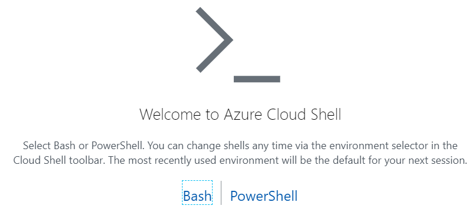
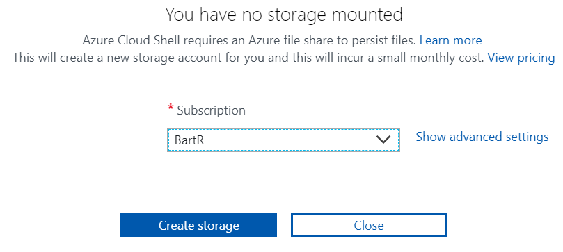
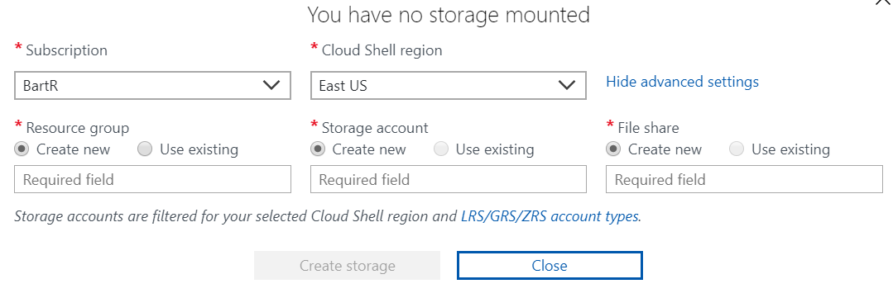

# Cloud Shell Setup

Launch the Azure Portal <https://portal.azure.com>

Click on the Cloud Shell icon in the top header (>_)

If this is the first time you've used Cloud Shell (you're really missing a cool Azure feature!) you will see this:

* Click on Bash

You will see this:

* Select your subscription
* Click Show Advanced Settings

You will see this:

* Select the Region
* Select or create the Resource Group (I use my alias - do NOT use "AKS" as we'll create/delete that later)
* Select or create the Storage Account (I use my alias but this has to be a unique DNS name)
* Select or create the File Share (I use clouddrive as the share name)

### Done!
